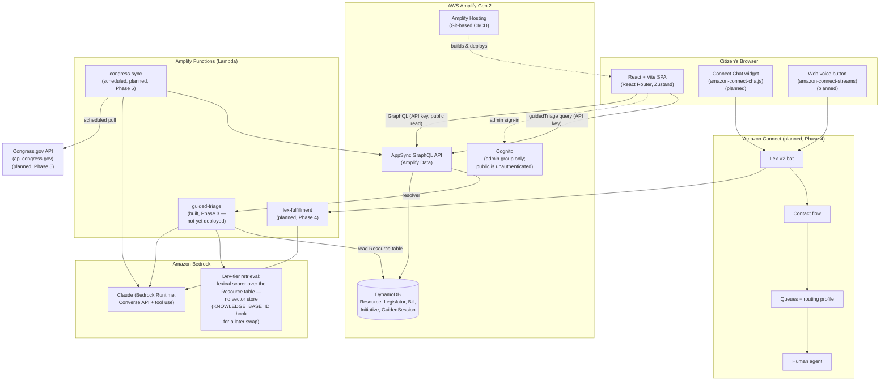

# Architecture

Status: **Phase 3 (AI Guided Help)**. This document describes the target
end-state architecture from the project spec. Components not yet built
are marked *(planned)*; see [../README.md](../README.md) for the
authoritative "what's real vs. stubbed" status as of the latest commit.

## System diagram



## Status (Phases 1–3)

- ✅ Vite + React 18 + TypeScript app shell, React Router, Tailwind v4,
  Zustand wired.
- ✅ Amplify Gen 2 backend defined (`amplify/backend.ts`) with Cognito
  auth (`admin` group, no public sign-up) and Amplify Data:
  `Resource`, `ResourceCategory`, `GuidedSession` — public API-key read,
  `admin`-group write; `GuidedSession` is create-only from the public
  client (a visitor can log a triage session but never read one back).
- ✅ Resource directory (`/resources`, `/resources/:slug`) backed by a
  ~30-entry verified seed catalog (`src/data/resources.seed.ts`). The
  data-access layer (`src/lib/resourceCatalog.ts`) reads the live
  `Resource` table when a backend is deployed and the bundled seed array
  otherwise, mapping both to one `CivicResource` shape. Filtering and
  faceting are pure and client-side (`src/lib/resourceFilters.ts`).
- ✅ `amplify/seed/seed.ts` upserts the catalog + taxonomy + an optional
  `admin` user into a deployed sandbox (`npm run sandbox:seed`).
- ✅ `amplify_outputs.json` ships as a labeled placeholder so the app
  runs in "offline/demo mode" without a deployed backend; `src/lib/amplify.ts`
  detects this and degrades gracefully rather than crashing.
- ✅ **AI Guided Help** (`/guide`). See the data flow below. The
  `guidedTriage` custom query (public API-key auth) routes to the
  `amplify/functions/guided-triage` Lambda; the frontend calls the
  deterministic offline engine instead when no backend is deployed.
- ⛔ **Not deployed.** No sandbox has been provisioned in this session —
  see README "Deploy" section for the command to run yourself.

## Guided triage data flow (Phase 3)

```
answers so far ──► runTriageStep (src/lib/guidedTriage/client.ts)
                     │
       backend live? ├─ no ─► nextTriageStep()  (localEngine.ts, deterministic)
                     │
                     └─ yes ─► AppSync `guidedTriage` query ─► guided-triage Lambda
                                   │
                                   1. scanForDistress(free text)  ─► crisis step (988 / GCAL from catalog), no model call
                                   2. buildProfile(answers) + scoreResources()  ─► top ~12 candidates from the REAL catalog
                                   3. Bedrock Converse (tool use: ask_question | give_recommendations),
                                      system prompt = triagePrompt.ts guardrails, candidates = the ONLY allowed slugs
                                   4. ground the reply: drop any slug not in the catalog; build the card from the
                                      catalog row (trusted) + the model's rationale (advisory)
                                   5. any failure ─► fall back to nextTriageStep()
                     ▼
        TriageStep { question | result | crisis }  ── same shape from either path ──►  wizard UI
                     │
        on a terminal step ─► GuidedSession.create({ PII-free summary, recommendedResourceSlugs, escalatedToHuman })
```

Key properties:

- **Grounded.** The model only ever sees a candidate set drawn from the
  catalog and may only return those slugs; anything else is dropped. It
  cannot invent a program, phone number, or URL. Retrieval is the
  dev-tier lexical scorer (`retrieval.ts`) over the `Resource` table —
  no vector store (see cost note). `KNOWLEDGE_BASE_ID` is a hook for a
  Bedrock Knowledge Base swap later.
- **Safe.** A keyword screen (`safety.ts`) runs before any model call;
  the system prompt independently forbids legal/medical/financial advice
  and eligibility determinations and requires a 988 hand-off on distress.
- **Private.** No account, no PII collected. `GuidedSession` stores only
  the derived structured summary (signals, matched categories,
  recommended slugs) — never the raw free text a visitor typed.
- **Consistent.** The offline engine and the Lambda share the question
  ladder, profile assembly, retrieval, and safety modules
  (`src/lib/guidedTriage/*`, import-light so the Lambda can reuse them),
  so chat/voice in Phase 4 can reuse the same brain.

## Key decisions & deviations from the spec, with rationale

- **Vector store for RAG (Phase 3):** the spec calls for Bedrock
  Knowledge Bases backed by OpenSearch Serverless. OpenSearch Serverless
  has an always-on minimum capacity floor (2 OCUs indexing + 2 OCUs
  search minimum, roughly **$700+/month** even at rest) that's hard to
  justify for a catalog of ~30 seed resources. Per your direction, Phase
  3 instead does retrieval with a lightweight structured + lexical scorer
  (`src/lib/guidedTriage/retrieval.ts`) over the `Resource` table — no
  embeddings, no vector store, zero standing cost. `guided-triage` reads
  `KNOWLEDGE_BASE_ID` from the environment: set it and the handler can be
  pointed at a Bedrock Knowledge Base (`retrieve`) as a drop-in upgrade
  for scale, keeping the same ranking contract.
- **No AWS deployment from this environment.** This build environment
  has no Node.js/npm and no configured AWS credentials, so Phase 1 is
  code-only — you'll run `npm install` and `npm run sandbox` yourself.
  All later phases follow the same pattern: infrastructure-as-code is
  written and reviewed here; you run the deploy commands.
- **No end-user accounts.** Cognito is used only for the `admin` group
  (catalog editors). Citizens never sign in — this matches the
  anonymous-by-default privacy requirement for guided help.

## IAM / security notes (expanded as functions are added)

- Amplify Functions get least-privilege access scoped by Amplify's
  resource-access grants (e.g. `data.grantAccess`), not broad
  `AmplifyBackend`-wide policies.
- **`guided-triage`** (Phase 3, `amplify/backend.ts`): the function role
  gets exactly two grants — `bedrock:InvokeModel` on
  `arn:aws:bedrock:*::foundation-model/anthropic.*` plus this account's
  `inference-profile/*anthropic.*` (// LIVE SETUP: narrow to the one
  pinned model once `BEDROCK_MODEL_ID` is set), and `grantReadData` on
  the `Resource` DynamoDB table (read-only, table name injected as
  `RESOURCE_TABLE_NAME`). No write access, no other services. The
  browser never calls Bedrock directly — it calls the AppSync
  `guidedTriage` query with the public API key; the Lambda holds the
  Bedrock credentials.
- Bedrock `InvokeModel`/`InvokeModelWithResponseStream` permissions are
  scoped to the specific model ID(s) actually used, not `bedrock:*`.
- `CONGRESS_GOV_API_KEY` and any Connect-related secrets are stored as
  Amplify backend secrets (`npx ampx sandbox secret set`), injected into
  Lambda environment variables at deploy time — never shipped to the
  browser bundle. Frontend `VITE_*` env vars are public by construction
  and hold only non-secret config (instance IDs, region, feature flags).
- The browser never holds long-lived AWS credentials. Connect
  chat/voice contacts are started using the pattern documented in
  `docs/connect-setup.md` (planned) — short-lived participant tokens
  issued per contact, not IAM user keys embedded in the frontend.
