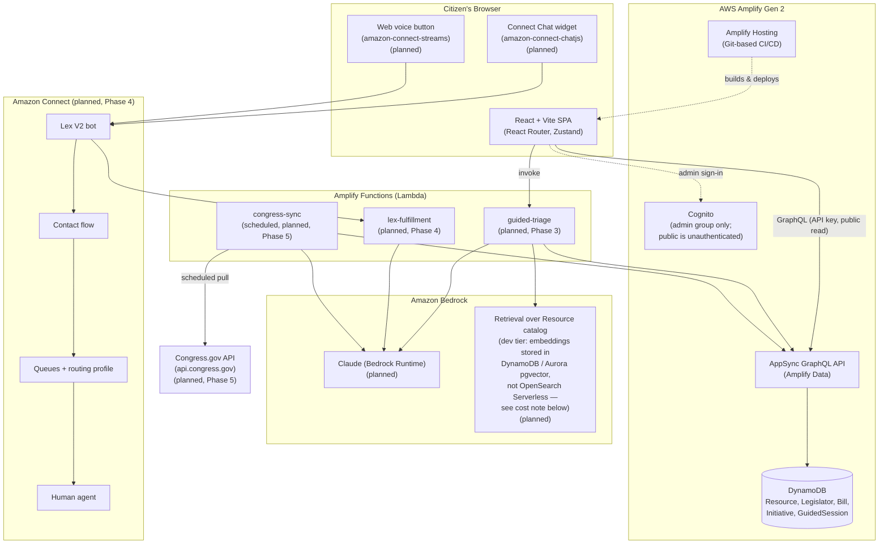

# Architecture

Status: **Phase 1 (scaffold)**. This document describes the target
end-state architecture from the project spec. Components not yet built
are marked *(planned)*; see [../README.md](../README.md) for the
authoritative "what's real vs. stubbed" status as of the latest commit.

## System diagram

## Phase 1 status (this commit)

- ✅ Vite + React 18 + TypeScript app shell, React Router, Tailwind v4,
  Zustand wired.
- ✅ Amplify Gen 2 backend defined (`amplify/backend.ts`) with Cognito
  auth (`admin` group, no public sign-up) and Amplify Data (a single
  `SiteStatus` smoke-test model — the full catalog schema lands in
  Phase 2).
- ✅ `amplify_outputs.json` ships as a labeled placeholder so the app
  runs in "offline/demo mode" without a deployed backend; `src/lib/amplify.ts`
  detects this and degrades gracefully rather than crashing.
- ⛔ **Not deployed.** No sandbox has been provisioned in this session —
  see README "Deploy" section for the command to run yourself.

## Key decisions & deviations from the spec, with rationale

- **Vector store for RAG (Phase 3):** the spec calls for Bedrock
  Knowledge Bases backed by OpenSearch Serverless. OpenSearch Serverless
  has an always-on minimum capacity floor (2 OCUs indexing + 2 OCUs
  search minimum, roughly **$700+/month** even at rest) that's hard to
  justify for a catalog of ~30 seed resources. Per your direction, Phase
  3 will instead do retrieval with Bedrock embeddings stored via Amplify
  Data/DynamoDB (or Aurora Serverless v2 + pgvector if the catalog grows
  past a few hundred items), with the OpenSearch Serverless path
  documented as a drop-in upgrade for scale. This will be re-confirmed
  with you before Phase 3 implementation.
- **No AWS deployment from this environment.** This build environment
  has no Node.js/npm and no configured AWS credentials, so Phase 1 is
  code-only — you'll run `npm install` and `npm run sandbox` yourself.
  All later phases follow the same pattern: infrastructure-as-code is
  written and reviewed here; you run the deploy commands.
- **No end-user accounts.** Cognito is used only for the `admin` group
  (catalog editors). Citizens never sign in — this matches the
  anonymous-by-default privacy requirement for guided help.

## IAM / security notes (expanded as functions are added)

- Amplify Functions get least-privilege access scoped by Amplify's
  resource-access grants (e.g. `data.grantAccess`), not broad
  `AmplifyBackend`-wide policies.
- Bedrock `InvokeModel`/`InvokeModelWithResponseStream` permissions are
  scoped to the specific model ID(s) actually used, not `bedrock:*`.
- `CONGRESS_GOV_API_KEY` and any Connect-related secrets are stored as
  Amplify backend secrets (`npx ampx sandbox secret set`), injected into
  Lambda environment variables at deploy time — never shipped to the
  browser bundle. Frontend `VITE_*` env vars are public by construction
  and hold only non-secret config (instance IDs, region, feature flags).
- The browser never holds long-lived AWS credentials. Connect
  chat/voice contacts are started using the pattern documented in
  `docs/connect-setup.md` (planned) — short-lived participant tokens
  issued per contact, not IAM user keys embedded in the frontend.
